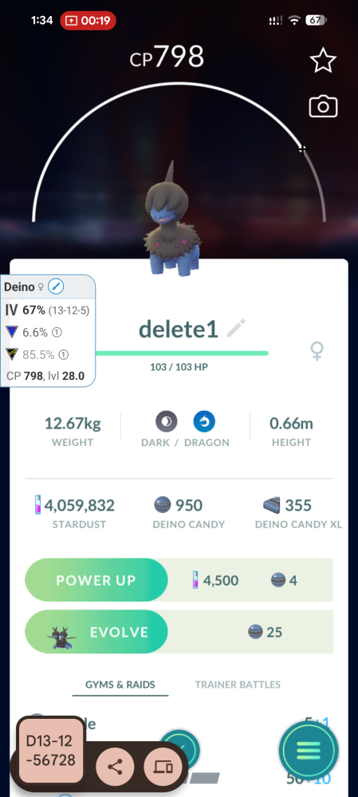

# pogo-pokegenie-automation

A local terminal workflow for automating parts of the Pokémon GO + Poke Genie review process.

## Support / Questions

If you have questions, need help with setup, or want to discuss the script, join the Discord server:

https://discord.com/invite/ghHr4xm7Et

After joining, check the `useful-scripts` thread.

## App Version

If you prefer a more integrated experience, similar functionality is available in the paid version of our DiscBall app. It allows you to run similar automations directly from your phone without using ADB.

## Demo Screenshot



## What it does

1. Scans Pokémon using the Poke Genie overlay/OCR.
2. Writes decisions to `captures/logs/pokegenie_scan_log.csv`.
3. Stops the Poke Genie overlay.
4. Renames Pokémon from the CSV in reverse order.

This tool only renames Pokémon. It does **not** transfer them.

## Native IV OCR and swipe navigation

Install the package from the project root with `python -m pip install -e .`.
For independently calculated ranks, set `POGO_POKEMON_DATA` to a complete JSON
file containing Pokémon base stats and CPM values. `POGO_FORM` defaults to
`NORMAL`; `POGO_MAX_LEVEL` defaults to `50`. The included example data is for
format reference only and is never selected automatically for real ranks.

During a scan, OCR runs over the full screenshot as well as the Poke Genie
crop. It finds the Attack, Defense/Defence, and HP labels, validates their
layout, predicts each bar from the label geometry, and refines the capsule by
colour. Native values, species comparison, ranks, confidence, and errors are
written to `captures/logs/pokegenie_scan_log.csv`; native-IV debug images are
written to `captures/crops/` alongside OCR crops and screenshots in
`captures/screenshots/`.

Navigation uses horizontal ADB swipes at the appraisal-arrow level. Next/right
means a right-to-left finger swipe; previous/left reverses it. Coordinates are
scaled from the active device size, with the known 1008×2244 layout used for
dry runs. Run a one-Pokémon non-destructive check with:

```bash
pogo workflow --count 1 --dry-run
```

Run the test suite with `python -m pytest`.

### Safe native evidence scan

`native-scan` reads only the currently open Pokémon GO appraisal panel. It
writes multiple frames after opening Appraise by menu OCR and a neutral
panel-settle tap, requires exact native-IV and species agreement, and
writes a JSON manifest. It never renames Pokémon. Form is explicit because a
silent `NORMAL` fallback is unsafe for forms with different base stats.

```bash
pogo native-scan --count 1 --frames-per-pokemon 3 --frame-delay-ms 350 \
  --form NORMAL --debug-native --manifest-output captures/logs/native_manifest.json
pogo manifest-status captures/logs/native_manifest.json
```

Use `--advance` only when scanning more than one Pokémon; every intentional
swipe is fingerprint-checked before the next scan. Legacy workflow rename is
now disabled by default. `--rename-after-scan` remains an explicit legacy
escape hatch and should not be used in place of verified native manifests.
Use `--already-appraising` only when the appraisal panel was opened manually.

### Local ranks and verified-native renaming

Build the local rank dataset once from a downloaded PokeMiners Game Master
JSON, then inspect a spread (including cap-relevant evolutions):

```bash
pogo build-rank-data latest.json --output captures/data/pokemon_stats_and_cpm.json
pogo rank Wooloo 8 4 1 --evolutions --suggest-name
```

`prepare-native-renames` consumes only `VERIFIED` native records. It computes
local GL/UL ranks for the Pokémon and its cap-relevant evolutions, keeps a
spread when either percentile is at least 95, keeps `14/14/14` or better for
raids, and otherwise assigns the `delete2` tag. The compact PvP name stores
league, raw rank up to 999 (or percentile above that), and evolution stage.
Use `--discard-tag remove2` if that is your preferred tag.

```bash
pogo prepare-native-renames captures/logs/native_manifest.json \
  --data captures/data/pokemon_stats_and_cpm.json \
  --output captures/logs/native_rename_manifest.json
pogo native-rename captures/logs/native_rename_manifest.json
```

The second command is a dry-run plan. To rename on the phone, start on the
**last Pokémon in that native scan with Appraise still open**, review the plan,
then add `--execute`. The executor refuses any manifest containing REVIEW or
incomplete entries, verifies the final native species and IVs before closing
Appraise with one middle tap, and aborts if a later detail-screen swipe does
not move to a different Pokémon:

```bash
pogo native-rename captures/logs/native_rename_manifest.json --execute
```

For a single end-to-end native-only run, use `native-workflow`. It scans
forward with right-to-left swipes and then renames backward with left-to-right
swipes, beginning at the last scanned Pokémon. It stops before any rename if
even one scan is REVIEW or cannot be ranked.

```bash
# Inspect the non-mutating plan first.
pogo native-workflow --count 10 --form NORMAL --debug-native

# Perform scan, rank, and verified-only reverse rename.
pogo native-workflow --count 10 --form NORMAL --debug-native --execute
```

## Full installation requirements

This project needs four things installed and working:

1. **Python / Conda environment** for OCR and automation.
2. **Google Android platform-tools ADB** for USB and Wi-Fi device control.
3. **Runtime Python package install** so the `pogo` command is available.
4. **Template images** under `captures/templates/`.

### 1. Create or update the Conda environment

From the project root:

```bash
conda env create -f environment.yml
conda activate pogo-automation
```

If the environment already exists:

```bash
conda activate pogo-automation
conda env update -f environment.yml --prune
```

Then install the project command:

```bash
python -m pip install -e .
```

Optional developer checks:

```bash
python -m pip install pytest
find pogo_auto -name "*.py" -print0 | xargs -0 python -m py_compile
python -m pytest
```

### 2. Install current Google platform-tools ADB on Linux

Convenience script:

```bash
scripts/install_platform_tools_linux.sh
```

Manual steps:

The Debian/Ubuntu `adb` package can be too old for modern Android wireless debugging. For example, `Version 28.0.2-debian` does not support `adb pair`.

Install Google platform-tools:

```bash
cd ~/Downloads
wget https://dl.google.com/android/repository/platform-tools-latest-linux.zip
unzip platform-tools-latest-linux.zip
mkdir -p ~/android
rm -rf ~/android/platform-tools
mv platform-tools ~/android/platform-tools
```

Use it in the current terminal:

```bash
export PATH="$HOME/android/platform-tools:$PATH"
which adb
adb version
```

Expected:

```text
/home/YOUR_USER/android/platform-tools/adb
Android Debug Bridge version 1.0.41
Version 37.x.x or newer
```

Make it permanent:

```bash
echo 'export PATH="$HOME/android/platform-tools:$PATH"' >> ~/.bashrc
source ~/.bashrc
which adb
adb version
```

### 3. USB setup

Plug in the phone and allow USB debugging on the phone.

```bash
adb kill-server
adb start-server
adb devices
```

Expected:

```text
SERIAL_NUMBER    device
```

Run:

```bash
pogo workflow --count 5
```

With multiple devices connected, pass the serial:

```bash
pogo workflow --count 5 --adb-serial SERIAL_NUMBER
```

### 4. Wi-Fi ADB setup

Wi-Fi mode works once `adb devices` shows a Wi-Fi device as `device`, not `offline`.

#### Android 11+ Wireless debugging menu

On the phone:

```text
Developer options → Wireless debugging → Pair device with pairing code
```

On the laptop:

```bash
adb pair PHONE_IP:PAIRING_PORT
```

Enter the pairing code from the phone.

Then go back to the main **Wireless debugging** screen. Use the separate **IP address & port** shown there:

```bash
adb connect PHONE_IP:CONNECT_PORT
adb devices
```

Expected:

```text
PHONE_IP:CONNECT_PORT    device
```

Run:

```bash
pogo workflow --count 5 --adb-serial PHONE_IP:CONNECT_PORT
```

Important: the pairing port and connect port are usually different. Use `adb pair` with the pairing-code port. Use `adb connect` with the main wireless-debugging port.

#### If Wi-Fi ADB shows `offline`

Convenience reset script:

```bash
scripts/wifi_adb_reset_notes.sh
```

Manual reset:

Reset the stale sessions:

```bash
adb disconnect
adb kill-server
adb start-server
adb devices
```

On the phone, toggle:

```text
Developer options → Wireless debugging → OFF → ON
```

Then reconnect to the new port shown on the phone:

```bash
adb connect PHONE_IP:NEW_CONNECT_PORT
adb devices
```

If it still shows `offline`, remove the old pairing on the phone:

```text
Developer options → Wireless debugging → Paired devices → Forget/remove laptop
```

Then pair again:

```bash
adb pair PHONE_IP:PAIRING_PORT
adb connect PHONE_IP:CONNECT_PORT
adb devices
```

#### Older cable-bootstrap Wi-Fi mode

Some devices also support:

```bash
adb -s USB_SERIAL tcpip CONNECT_PORT
adb shell ip route
adb connect PHONE_IP:CONNECT_PORT
adb devices
```

Run:

```bash
pogo workflow --count 5 --adb-serial PHONE_IP:CONNECT_PORT
```

For recent Android versions, the Wireless debugging pairing-code method is usually more reliable.

### 5. Template files

Required templates must be in:

```text
captures/templates/
```

Typical required files:

```text
three_bar_menu_template.png
rename_pencil_template.png
rename_ok_template.png
pokegenie_overlay_template.png
```

Copy templates from an older working folder if needed:

```bash
mkdir -p captures/templates
cp ~/pogo_automation/captures/templates/*.png captures/templates/
```

Templates are never removed by `pogo clean`.

### 6. Clean start and run

The workflow automatically removes old screenshots, crops, and logs before each run:

```bash
pogo workflow --count 5
```

Manual cleanup:

```bash
pogo clean
```

Disable clean start for one run:

```bash
pogo workflow --count 5 --no-clean-start
```

### 7. Current nickname format

PvP names are compact and include the league plus the Poke Genie evolution/form marker:

```text
G6371       Great League 63.7, marker 1
U9541       Ultra League 95.4, marker 1
G9720U9542  Great 97.2 marker 0 + Ultra 95.4 marker 2
```

IV names are compact digits:

```text
151414      IV 15/14/14
```


## Current status

This is refactor v1.3 sanitized.

The proven working scanner and renamer are still preserved as:

```text
pogo_auto/legacy_scan.py
pogo_auto/legacy_rename.py
```

The surrounding project is now modular:

```text
pogo_auto/
  adb.py          USB/Wi-Fi ADB target helpers
  apps.py         Android app package actions
  cli.py          terminal commands
  doctor.py       setup diagnostics
  workflow.py     scan → kill Poke Genie → rename orchestration
  runners.py      subprocess module runner used by compatibility layer
  scan.py         scan-pass API wrapper
  rename.py       rename-pass API wrapper
  navigation.py   fixed triangle navigation helpers
  settings.py     config dataclasses and JSON config loading
  names.py        nickname formatting and decision helpers
  templates.py    reusable OpenCV template matching helpers
  ui.py           screen coordinates/scaling helpers
  ocr.py          PaddleOCR wrapper
  logs.py         CSV helpers
  paths.py        project paths
```

## Linux setup

```bash
sudo apt update
sudo apt install android-tools-adb -y

cd pogo-pokegenie-automation-refactor-v1.3-sanitized
./setup_linux.sh
conda activate pogo-automation
pogo devices
```

## Windows setup

Install Android Platform Tools / ADB first. Then:

```powershell
cd pogo-pokegenie-automation-refactor-v1.3-sanitized
.\setup_windows.ps1
conda activate pogo-automation
pogo devices
```

## USB workflow

```bash
pogo devices
pogo workflow --count 5
```

If multiple devices are connected:

```bash
pogo workflow --count 5 --adb-serial USB_SERIAL
```

## Wi-Fi ADB workflow

Android 11+ pairing:

```bash
pogo wifi-pair PHONE_IP --port PAIRING_PORT
pogo wifi-connect PHONE_IP --port CONNECT_PORT
pogo workflow --count 5 --adb-serial PHONE_IP:CONNECT_PORT
```

Older cable bootstrap Wi-Fi ADB can also be used outside the tool:

```bash
adb tcpip CONNECT_PORT
adb connect PHONE_IP:CONNECT_PORT
pogo workflow --count 5 --adb-serial PHONE_IP:CONNECT_PORT
```

## Config file

Create a config:

```bash
pogo init-config --output config.json
```

Then edit it and run:

```bash
pogo workflow --config config.json
```

Command-line options override device selection:

```bash
pogo workflow --config config.json --adb-serial PHONE_IP:CONNECT_PORT
```

## Templates

Copy known-good template PNGs into:

```text
captures/templates/
```

Required:

```text
rename_pencil_template.png
rename_ok_template.png
three_bar_menu_template.png
right_triangle_template.png (optional visual reference; swipes navigate normally)
pokegenie_overlay_template.png
```

The Appraise menu entry is selected by OCR, so `appraise_template.png` is not
required. If the menu OCR misses it, the workflow uses its scaled Appraise
coordinate as a fallback.

## Main commands

```bash
pogo devices
pogo doctor
pogo clean
pogo scan --count 5
pogo kill-pokegenie
pogo rename --count 5
pogo workflow --count 5
```

`pogo doctor` checks ADB, Python imports, connected devices, and required template files.


Dry run:

```bash
pogo workflow --count 5 --dry-run
```

## Naming logic

PvP keeps use short league-prefixed values:

```text
G9810       Great League / blue row 98.1, base/form marker 0
U9541       Ultra League / yellow-orange row 95.4, form marker 1
G9720U9542  both leagues passed threshold, markers 0 and 2
```

This fits the Pokémon GO nickname limit better than `97.2(1)95.4(2)`.

IV keeps use compact IV digits:

```text
151414
```

Rename candidates use:

```text
delete1
```

## Development checks

```bash
python -m pytest
python -m py_compile pogo_auto/*.py
```

## Safety

Review the CSV before renaming:

```bash
cat captures/logs/pokegenie_scan_log.csv
```

Use at your own risk.
